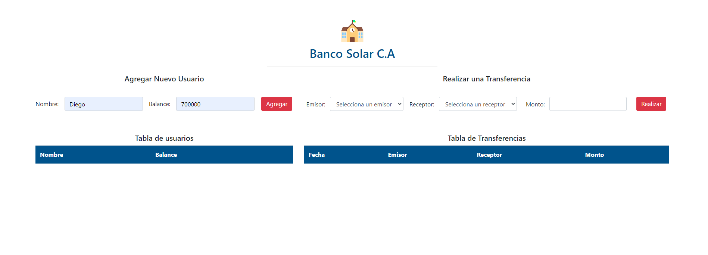
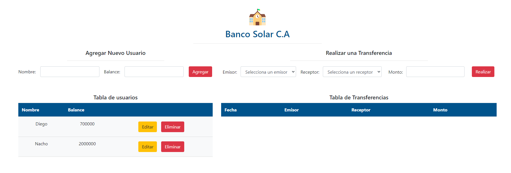
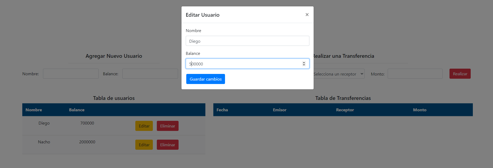
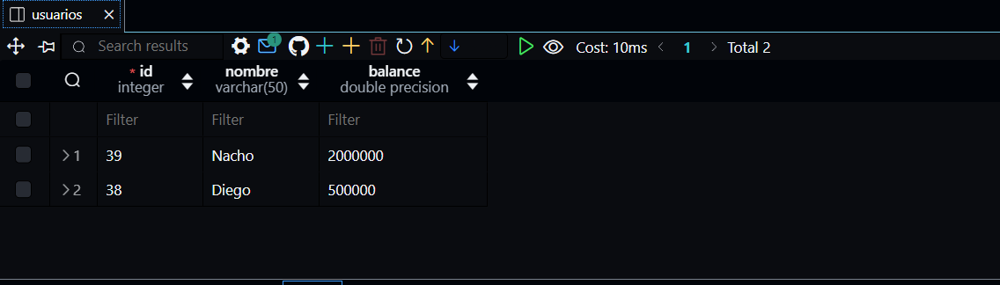
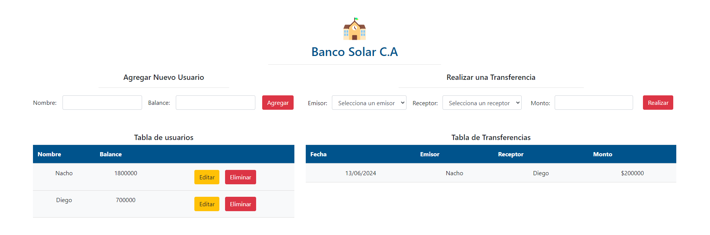

#asi se creo la base de datos:

\*\*CREATE TABLE usuarios (
id SERIAL PRIMARY KEY,
nombre VARCHAR(50),
balance FLOAT CHECK (balance >= 0)
);
CREATE TABLE transferencias (
id SERIAL PRIMARY KEY,
emisor INT,
receptor INT,
monto FLOAT,
fecha TIMESTAMP,
FOREIGN KEY (emisor) REFERENCES usuarios(id) ON DELETE CASCADE,
FOREIGN KEY (receptor) REFERENCES usuarios(id) ON DELETE CASCADE
);

SELECT \* FROM transferencias

SELECT \* FROM usuarios

//se modifico la columna fecha porque daba un error y se inicializó

ALTER TABLE transferencias
ALTER COLUMN fecha SET DEFAULT CURRENT_TIMESTAMP;\*\*

npm install pg express dotenv cors
npm i -g nodemon para instalarlo globalmente

imagenes:

